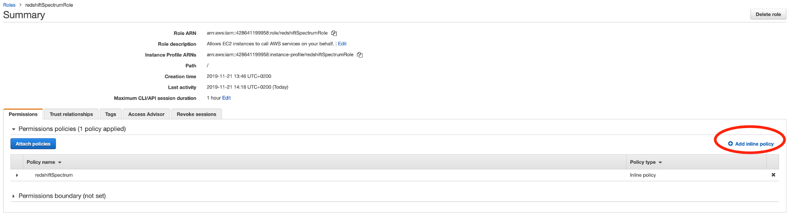
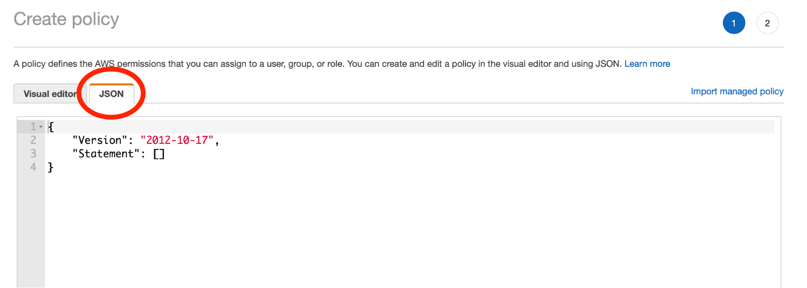

# Connect Redshift Spectrum To Glue Data Catalog

## Create a role for Redshift Spectrum

1. Sign in to aws console
2. Open the IAM console at [https://console.aws.amazon.com/iam](https://console.aws.amazon.com/iam)
3. Choose **Roles **from the left navigation menu
4. Choose **Create role**
5. Choose **Redshift** from the list of services
6. Choose **Reshift - Customizable** under the “Select your use case” section
7. Choose **next**
8. Choose **next : Tags**
9. Choose **next : review**
10. Choose a name for your role, e.g: redshiftSpectrumRole
11. Choose **Create role**
12. In the roles page, look for the role you have just created (by its name) and click on it
13. Choose the **add inline policy** button
    
14. Choose the JSON editing option
    
15. Paste the following policy (make sure to **clear the **default base policy before pasting):
```json
    {

        "Version": "2012-10-17",
        "Statement": [
                {
            		"Effect": "Allow",
            		"Action": ["s3:Get*", "s3:List*"],
            		"Resource": "*"
        	    },
        	    {
                    "Effect": "Allow",
                    "Action": [
                        "glue:CreateDatabase",
                        "glue:DeleteDatabase",
                        "glue:GetDatabase",
                        "glue:GetDatabases",
                        "glue:UpdateDatabase",
                        "glue:CreateTable",
                        "glue:DeleteTable",
                        "glue:BatchDeleteTable",
                        "glue:UpdateTable",
                        "glue:GetTable",
                        "glue:GetTables",
                        "glue:BatchCreatePartition",
                        "glue:CreatePartition",
                        "glue:DeletePartition",
                        "glue:BatchDeletePartition",
                        "glue:UpdatePartition",
                        "glue:GetPartition",
                        "glue:GetPartitions",
                        "glue:BatchGetPartition",
               	        "lakeformation:GetDataAccess"
                    ],
                    "Resource": [
                        "*"
                    ]
                }
            ]
    }
```     
16. Choose **Review policy**
17. Give a name to your policy, e.g “redshiftSpectrum”
18. Choose **Create Policy**
19. Make a note of the role ARN and keep it handy - we will need that for external schema creation
20. Open the Redshift console at [https://console.aws.amazon.com/redshift](https://console.aws.amazon.com/redshift) 
21. Choose **clusters**
22. Do the following actions per each Redshift cluster you would like to use Redshift Spectrum
    1. Click on the desired cluster
    2. Under “cluster properties” section, choose **See IAM roles.**
    3. Locate the role name you’ve created in section #10 above and choose it
    4. Click on apply changes

## Create external schema

1. Run the following query in the cluster (this can be done either via “Query Editor” section under the Redshift Management Console or via your favorite SQL editor:
```sql
    create external schema spectrum_schema from data catalog 
    database ‘<database name>’ 
    iam_role '<the role ARN you kept from section #18 above>'
    create external database if not exists;
```
2. Open the Lake Formation console at [https://console.aws.amazon.com/lakeformation](https://console.aws.amazon.com/lakeformation) 
3. In the navigation pane, choose **Permissions**, and then choose **Data permissions**
4. Provide the following information (for additional details - please go to https://docs.aws.amazon.com/redshift/latest/dg/c-getting-started-using-spectrum-create-role.html):
    *   For **IAM role**, choose the IAM role you created, _redshiftSpectrumRole_. When you run the Amazon Redshift Query Editor, it uses this IAM role for permission to the data.
    *   For **Database**, choose your Lake Formation database. 
    *   For **Table**, choose a table within the database to query.
    *   For **Columns**, choose All Columns.
    *   Choose the **Select** permission.
5. Choose **Save**.
