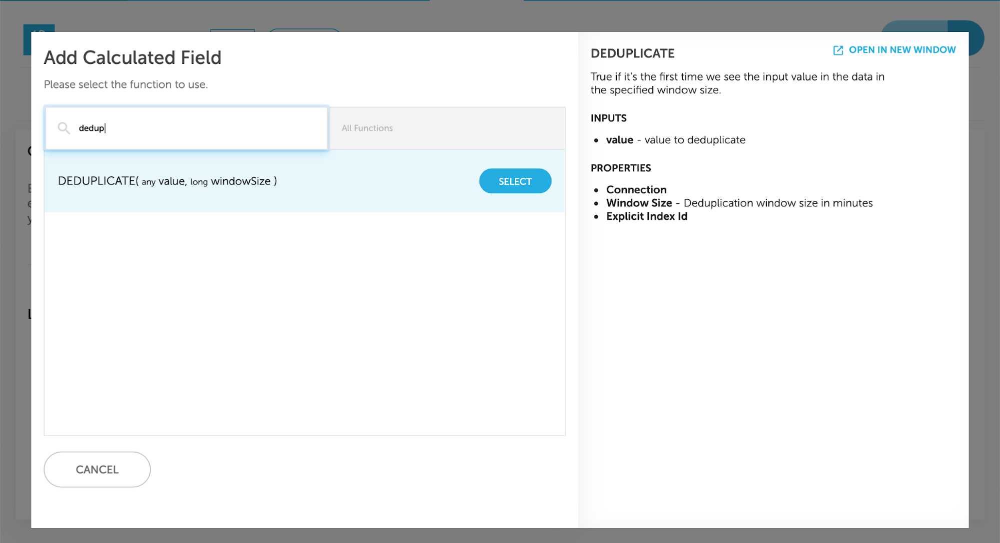
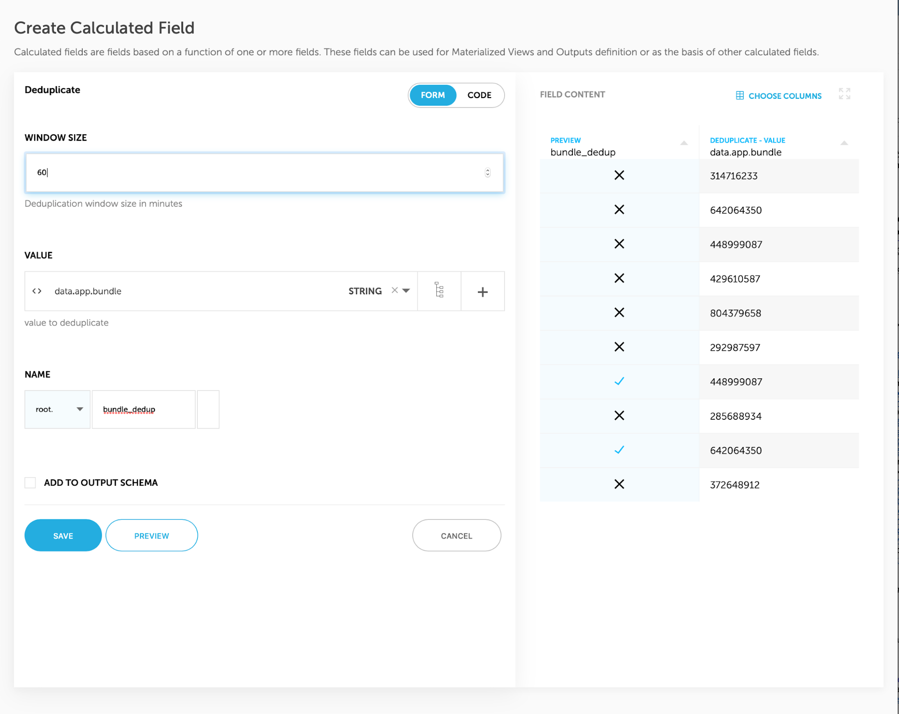

# Deduplicate Events

Filter events in or out of a given output, based on a key that appears multiple times in a specific time window - without writing a single line of code.

# Deduplicating Events in Upsolver

1. Go to Enrichments tab in your Output / Materialized View and and click on the “+” next to “Calculated Fields” to add a Calculated Field
   
2. Look for the “DEDUPLICATE” function and select it
   
3. Set the window size in minutes and select the value to deduplicate.
   The DEDUPLICATE function returns true for values that recurred within the given window size. After adding the Calculated Field, you can filter on it to get the wanted result: whitelist will return only events that their value is reoccured, blacklist will return only events that their value isn’t occured in the given window time.
   
   
 

