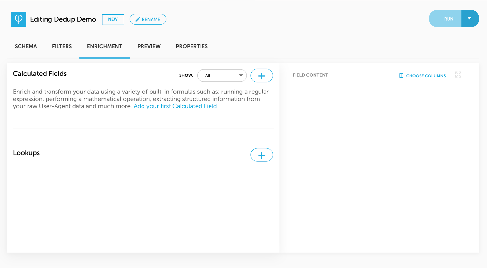
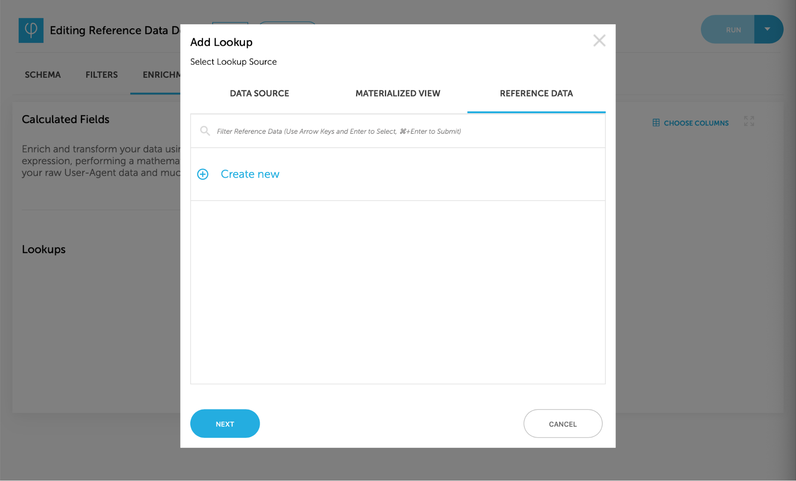
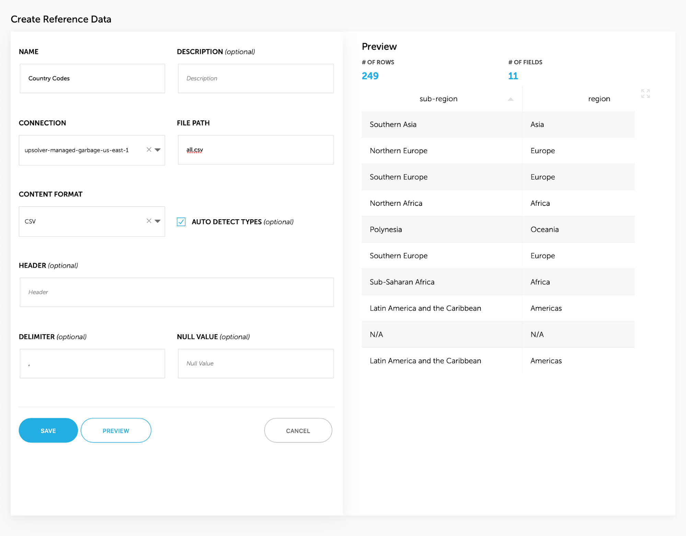
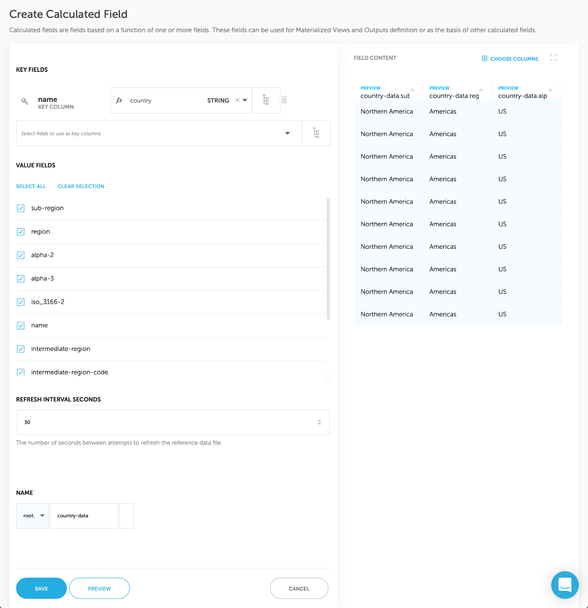

# Reference Data

Upsolver enables you to look-up an external dataset as a reference source for querying or enriching a stream.

# Creating Reference Data

1. Go to Enrichments tab in your Output / Materialized View and and click on the “+” next to “Lookup” to add a Calculated Field
   
2. Select the “Reference Data” tab and click and select existing Reference Data or click on “Create new” to create new one
   
3. Fill the information in the form and click preview to check your data, click on save when you’re done.
   
4. Select the fields to use as key column from the Reference Data and map their values to the fields in the Output / Materialized View you’re editing; Select the value fields to export from the Reference Data and you’re done.
   

