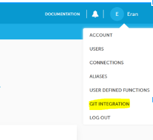
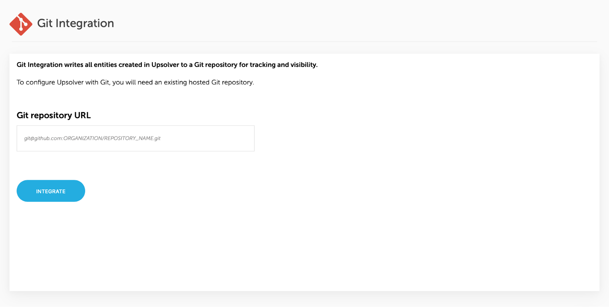

# Git Integration

WIth one click, you can integrate Upsolver with your Git repository. All Upsolver configurations, objects and metadata will be synced to your repository in real-time.

If you're not hosting your repository in [GitHub](https://www.github.com) or [GitLab](https://www.gitlab.com), please contact us by clicking on the Intercom widget in the bottom right corner of this page.

## Integrating Upsolver with Git

1. Click on your user name to open the menu and click on Git Integration
   
   
2. Follow the instructions in the page
   
   

## Adding an SSH Key to a GitHub Repository

To add an SSH Key to a GitHub Repository:

1. Navigate to your repository in [GitHub](https://www.github.com)
2. Click on "Settings"
3. Click on "Deploy keys" in the left navigation bar
4. Click on "Add deploy key"
5. Fill the form
   - Title: "Upsolver Git Integration"
   - Key: Copy and paste the key
   - Allow Write Access: Check
6. Submit the form

## Adding an SSH Key to GitLab Repository

[See more information in GitLab Documentation](https://docs.gitlab.com/ce/ssh/README.html#per-repository-deploy-keys).
