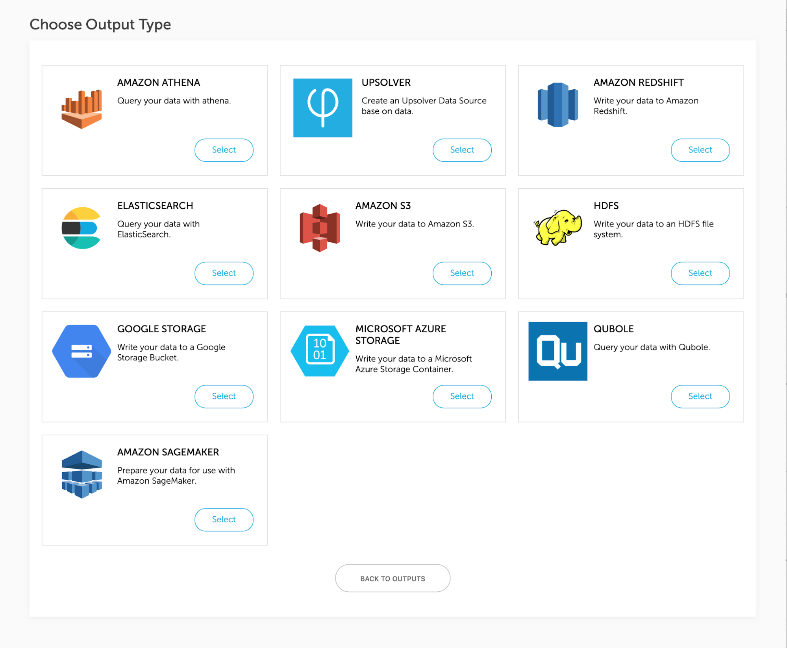
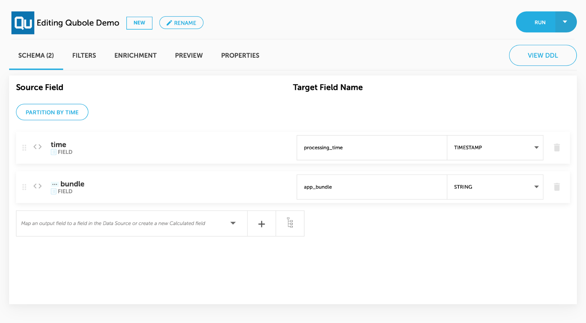
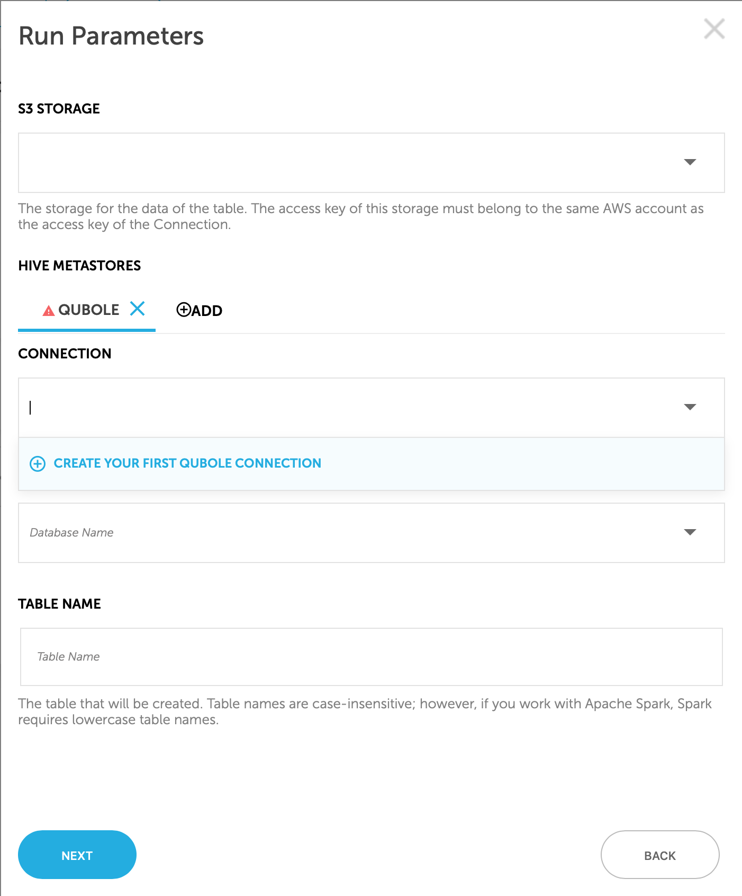

# Qubole Output

 Qubole is a popular platform used to query and process large datasets in cloud and on-premise data lakes. Qubole Output
 will allow you to leverage Upsolver’s strong ETL and data management capabilities to ingest streaming data into your 
 data lake and prepare it for further analysis in Qubole.

## Creating Qubole Output

1. Navigate to Outputs in the top navigation bar and click on “Add Output”
2. Select the Qubole output type 
   
3. Create the wanted output
4. To deploy the output, click on “Run”
   
5. If you haven’t deployed a Qubole output before, you’ll be prompted to create a new Qubole Connection:
   
6. Create a qubole connection, select the database name and table name you’ll want to export data to, click on “Next” and then deploy the output
   
