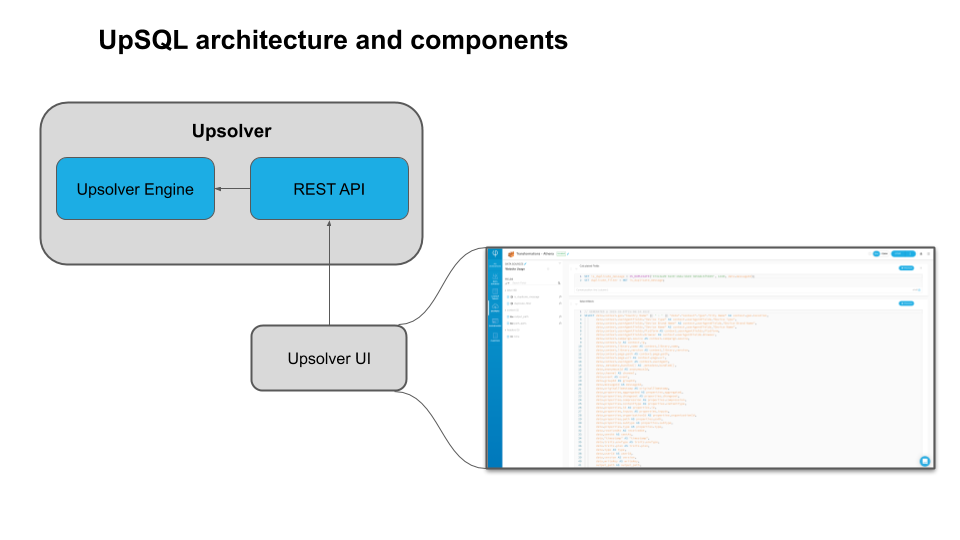

# Upsolver SQL

## What is Upsolver SQL (UpSQL)

UpSQL provides an easy to use and powerful SQL interface for data ingestion, integration and transformation when creating Upsolver Outputs, without the need to write code in a programming language such as Java or Python.

## The Basics

UpSQL is based on ANSI SQL so it is easy and intuitive to use for anyone with basic SQL knowledge. Users write regular SQL queries with extensions for streaming data use cases such as window aggregations, and the Upsolver engine continuously executes the queries. 

UpSQL is used  to ingest data, read data from various streaming sources and data lakes (including Amazon S3, Amazon Kinesis Streams and Apache Kafka) and writing data to the desired target (such as: Amazon Athena, Amazon Redshift, ElasticSearch and RDS).

## Topics
1. [Mapping Data to a Desired Schema](https://docs.upsolver.com/UpSQL/mapping-data-to-desired-scheme.html)
2. [Transforming Data](https://docs.upsolver.com/UpSQL/TransformingData/)
3. [Aggregate Streaming Data](https://docs.upsolver.com/UpSQL/aggregate-streaming-data.html)
4. [Query Hierarchical Data](https://docs.upsolver.com/UpSQL/query-hierarchical-data.html)
5. [UpSQL Syntax Reference](https://docs.upsolver.com/UpSQL/upsql-syntax-reference.html)