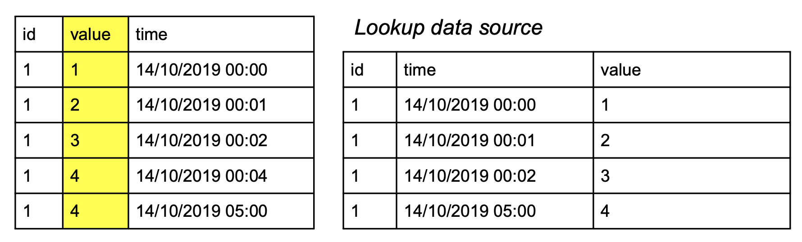
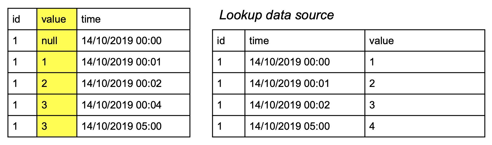
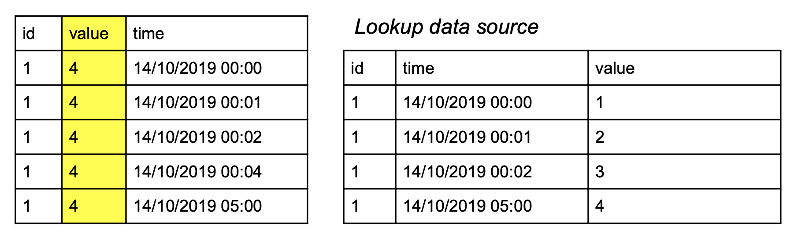
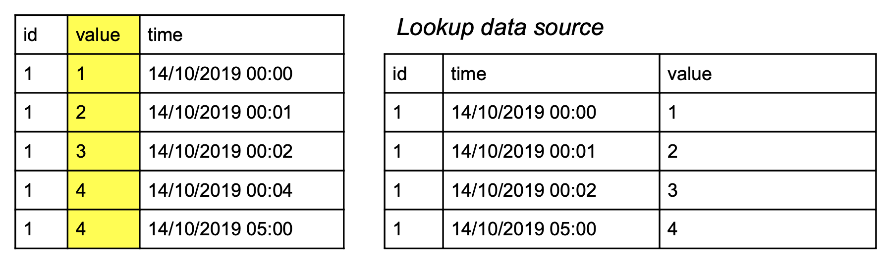

# Join Data From Several Data Sources

You can use UpSQL to combine data from your streaming data source with data arriving in other streams, historical aggregations or reference data files.

This can be done using UpSQL join syntax. The result of the UpSQL join is a new table that’s populated with the column values that you specify in the SELECT statement.

With UpSQL there is no need to write code in any programming language such as Java or Python to join data from various data sources - all you need is use UpSQL join.

# JOIN clause

UpSQL join clause uses the following syntax:

```
[ { INNER | LEFT [ OUTER ] } ] JOIN [ LATEST ]

    { table_name | ( query_expr ) } [ [ AS ] alias ] [ WAIT integer { MINUTE[S] | HOUR[S] | DAY[S] } [ ALIGNED ] ]

    { ON bool_expression | USING ( field_name [, ...] ) }
```

For the following example, we will assume we have the following events structure in _clicks_ data source over time:

```
{“user_id” : 1, “campaign_id” : “camp1”}
{“user_id” : 2, “campaign_id” : “camp2”}
```

We will also assume we have the following events in _orders_ data source over time:

```
{“user_id” : 1, “credit_card_type” : “VISA”, “order_price” : 150 }
{“user_id” : 1, “credit_card_type” : “VISA”, “order_price” : 50}
{“user_id” : 2, “credit_card_type” : “AMEX”, “order_price” : 20}
```

**If we define a table as:**

```
SELECT user_id, campaign_id
FROM clicks JOIN (SELECT COUNT_DISTINCT(*) as user_orders,
			          User_id AS user_id
		       FROM orders
		       Group by user_id) user_purchases
		       ON user_purchases.user_id = user_id
```

**We will have the following table as output:**

<table>
  <tr>
   <td>user_id
   </td>
   <td>campaign_id
   </td>
   <td>user_orders
   </td>
  </tr>
  <tr>
   <td>1
   </td>
   <td>“camp1”
   </td>
   <td>2
   </td>
  </tr>
  <tr>
   <td>2
   </td>
   <td>“camp2”
   </td>
   <td>1
   </td>
  </tr>
</table>

# Join requirements

## Join table

The join table must be either Lookup Table or Reference Data.

## ON statement

The `ON` statement must be in one of the following forms:

*   `lookup_key_1 = expression AND lookup_key_2 = expression ...`
*   `lookup_key_1 IN (expression1, ...) AND lookup_key_2 IN (expression1, ...) ...`

_Please note: each key in the Lookup Table must be mapped to one or more expressions_

_using either `=` or `IN` within the ON statement._

# Synchronize Streams

Since Upsolver is a streaming system, all joins are applied in stream time. 

To demonstrate the concepts, we will assume having the following data sources:

_main data source_:

<table>
  <tr>
   <td>id
   </td>
   <td>time 
   </td>
  </tr>
  <tr>
   <td>1
   </td>
   <td>14/10/2019 00:00
   </td>
  </tr>
  <tr>
   <td>1
   </td>
   <td>14/10/2019 00:01
   </td>
  </tr>
  <tr>
   <td>1
   </td>
   <td>14/10/2019 00:02
   </td>
  </tr>
  <tr>
   <td>1
   </td>
   <td>14/10/2019 00:04
   </td>
  </tr>
  <tr>
   <td>1
   </td>
   <td>14/10/2019 05:00
   </td>
  </tr>
</table>

_lookup data source_:

<table>
  <tr>
   <td>id
   </td>
   <td>time
   </td>
   <td>value
   </td>
  </tr>
  <tr>
   <td>1
   </td>
   <td>14/10/2019 00:00
   </td>
   <td>1
   </td>
  </tr>
  <tr>
   <td>1
   </td>
   <td>14/10/2019 00:01
   </td>
   <td>2
   </td>
  </tr>
  <tr>
   <td>1
   </td>
   <td>14/10/2019 00:02
   </td>
   <td>3
   </td>
  </tr>
  <tr>
   <td>1
   </td>
   <td>14/10/2019 05:00
   </td>
   <td>4
   </td>
  </tr>
</table>

For the above data sources - id is an Integer and time is a time-stamp in DD/MM/YYYY HH:MM format which represents the event's creation time.

## WAIT Interval

In order to synchronize between streams, UpSQL supports the `WAIT integer { MINUTE[S] | HOUR[S] | DAY[S] } [ ALIGNED ]` syntax. 

If `WAIT X MINUTES` (X is an Integer) is specified, Upsolver ensures that the state of the joined lookup table is ready X minutes ahead of the data being processed. This will cause the output to be delayed by X minutes.

We will demonstrate this using the following UpSQL query:

```
SELECT id,
	   value,
	   Time
From “main data source”
LEFT JOIN 
	(
	  SELECT id, LAST(value) value
	  FROM “lookup data source”
	  GROUP BY id
	) l WAIT 1 MINUTE
	ON i.id = id 
```

The result of this query will be the following:



Note that while performing the JOIN, we wait 1 minute for each event in _main data source_ before creating the output. 
If we look at the first row in the above table, we can see that for time 14/10/2019 00:00 we take into consideration only the first event in _lookup data source_ which has the same value in the time field - that event arrived in 1 MINUTE delay. 
This is the behaviour since per each event in _main data source_ we look at the matching events in _lookup data source_ which has values in their time field which are less than 14/10/2019 00:00 plus 1 minute (due to WAIT 1 MINUTE statement) which results in 00:01 as a time comparator. 

The only event which complies with this comparator is the first event in _lookup data source_ which has 00:00 in it’s time field.
Without using the WAIT 1 MINUTE the result will be:

If we look again at the first row in the above table, we can see that for time 14/10/2019 00:00 we have no event with time prior to 14/10/2019 00:00 (excluding this timestamp). 
This is the behaviour since per each event in _main data source_ we look at the matching events in _lookup data source_ with time less than 14/10/2019 00:00 (since we did not use the WAIT statement). 


## ALIGNED

If the keyword `ALIGNED` is being used, calculating the query's result will wait for the next aligned window. For example, data arriving after 08:35 and before 08:40 will wait until 08:40. 

The alignment is done using unix epoch time, so `WAIT 1 DAY` will wait until 00:00 UTC of the following day.

We will demonstrate this using the following UpSQL query:

```
SELECT id,
	   value,
	   Time
From “main data source”
LEFT JOIN 
	(
	  SELECT id, LAST(value) value
	  FROM “lookup data source”
	  GROUP BY id
	) l WAIT 5 MINUTES ALIGNED
	ON i.id = id 
```

The result of this query will be the following:



Note that, while performing the join, we wait 5 minutes aligned before creating the output. This means that per each event in our _main data source_ we wait for the event on 14/19/2019 05:00 to create the output. That’s why the _value_ column in the output has the value 4 for all of the events.
## LATEST
When running a query over historical data, Upsolver maintains the time relation between streams in the same way as it would when processing data that is up to date. 
The `LATEST` keyword is intended to handle situations where initial data is dumped into a lookup table after the source stream started running. 
This forces the query to use the state of the joined lookup table that exists when it is being run for all historical data. Data that arrived after the query was run is not affected by `LATEST`.
We will demonstrate this using the following UpSQL query:
```
SELECT id,
	   value,
	   Time
From “main data source”
LEFT JOIN LATEST
	(
	  SELECT id, LAST(value) value
	  FROM “lookup data source”
	  GROUP BY id
	) l WAIT 1 MINUTE
	ON i.id = id 
```
The result of this query depends on the time you run it relative to the event's time:
1. Query run time is less than the event’s creation time field (e.g: run the query on 13/10/2019 09:00) the result would be:




2. Query run time is greater than the event’s creation time - in this situation, we relate to the query's run time instead of the event creation time field - if, for example, you run the query on 15/10/2019 09:00 the result would be:
  
