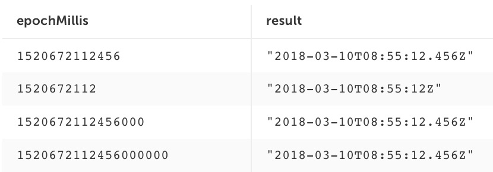

# Perform Calculations And Conversions

UpSQL enables you to improve the quality of your data and ensure it follows standard conventions (e.g. convert time in Epoch to standard mm/dd/yyyy). 

Upsolver contains all the functions that exist in SQL as [built-in functions](https://docs.upsolver.com/Functions/Calculated/), including special enrichment functions (e.g. IP2GEO, user agent parser) and you can add your own User Defined Functions (UDFs) in Python. 

Both built-in functions and UDFs can be applied on either flat or hierarchical data. 

**For the following examples, we will assume that:**


1.  Three events stream into the data source `heartbeat` over time:

```
{ "user_id": 1, “device_id”: 1234, “epoch” : 1520672112456, “heart_rate” : 81}

{ "user_id": 2, “device_id”: 5567, “epoch” : 1520672112456, “heart_rate” : 79}

{ "user_id": 1, “device_id”: 1234, “epoch” : 1520672113456, “heart_rate” : 102}
```


2. Three events stream into data source `location` over time:

```
{“user_id”: 1, “epoch” : 1573034761, “latitude” : 28.545926, “longitude” : 31.577451}

{“user_id”: 2, “epoch” : 1573034761, “latitude” : 44.032321, “longitude” : 1.356295}

{“user_id”: 1, “epoch” : 1573035761, “latitude” : 28.545926, “longitude” : 31.577451}
```

We will use the built-in function UNIX_EPOCH_TO_DATE which converts unix epoch date to a date as follows:


The following query creates an output which is based on a stream transformation using UNIX_EPOCH_TO_DATA inline the SELECT clause:
```SQL
SELECT user_id, device_id, UNIX_EPOCH_TO_DATA(epoch) as date
FROM heartbeat
```
The result of the query will be the following output:

<table>
  <tr>
   <td>user_id
   </td>
   <td>device_id
   </td>
   <td>date
   </td>
  </tr>
  <tr>
   <td>1
   </td>
   <td>1234
   </td>
   <td>2018-03-10T08:55:12.456Z
   </td>
  </tr>
  <tr>
   <td>2
   </td>
   <td>5567
   </td>
   <td>2018-03-10T08:55:12.456Z
   </td>
  </tr>
  <tr>
   <td>1
   </td>
   <td>1234
   </td>
   <td>2018-03-10T08:55:13.456Z
   </td>
  </tr>
</table>

The following query creates an output which is based on a stream transformation using UNIX_EPOCH_TO_DATA in two steps:

1. Calculate the transformation:

    ```SQL
    SET date = UNIX_EPOCH_TO_DATA(epoch);
    ```

2. Using the calculated transformation in the query:

    ```SQL
    SELECT user_id, device_id, date
    FROM heartbeat
    ```